# # TeamProject
Jave와 OracleDB를 사용한 도서관리 프로그램입니다.
도서자료는 대구시립북부도서관의 csv 파일을 활용하였습니다.

## # 개요

  - Java Swing 프로젝트를 소개하는 역할을 합니다.

## # 순서도 및 화면 소개

|화면|사진|
|:--:|--|
|순서도||
|도서 검색 및 대여|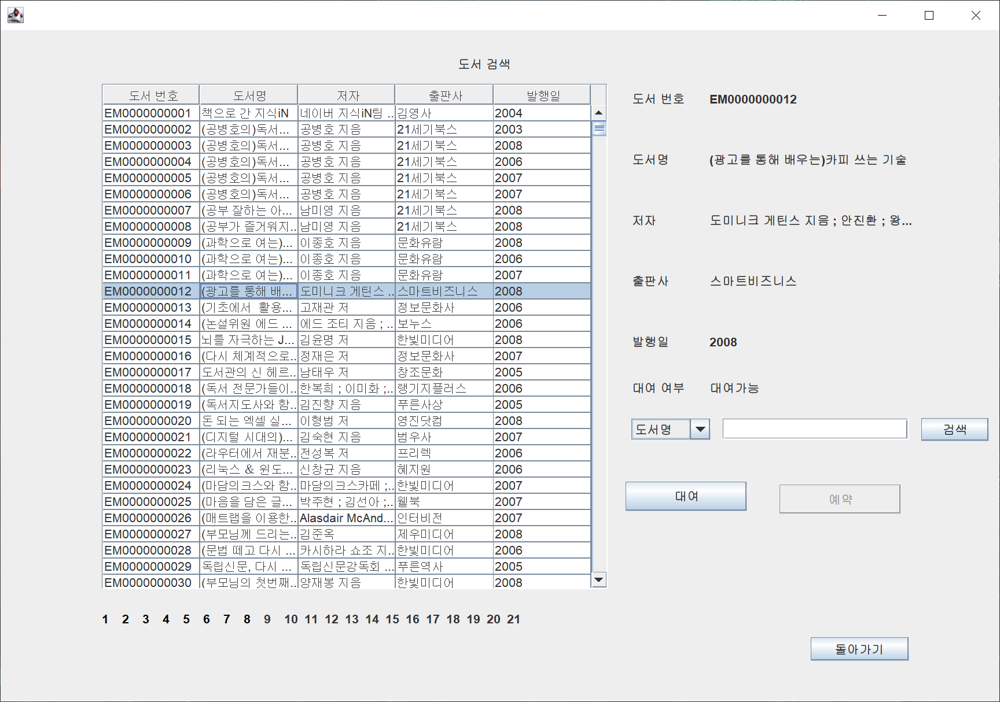|
|마이페이지<br>(조회)||
<details>
    <summary>사진 더보기</summary>

|화면|사진|
|:--:|--|
|로그인|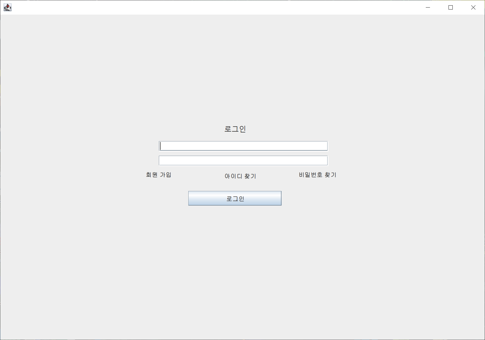|
|메인페이지|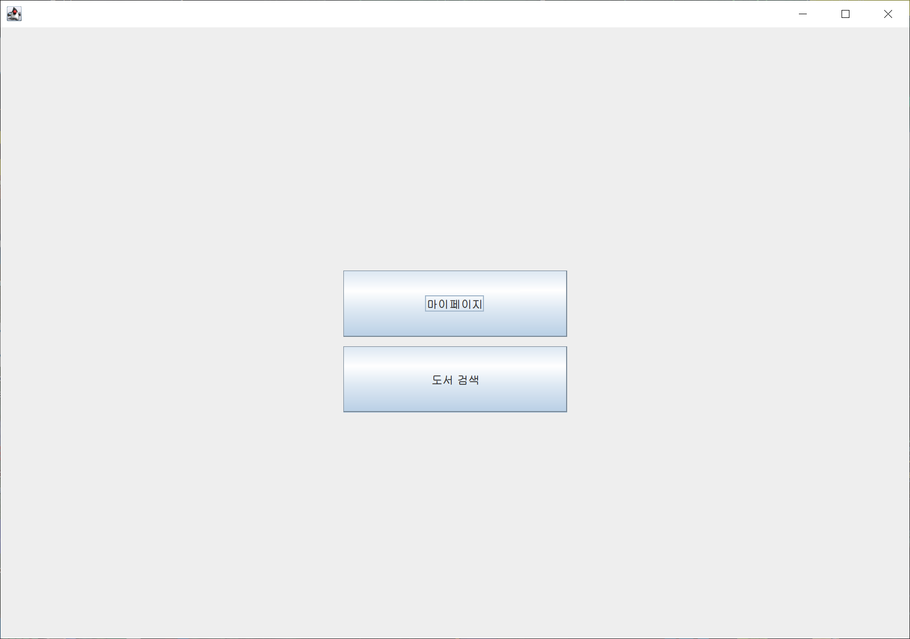|
|마이페이지<br>(개정정보수정)|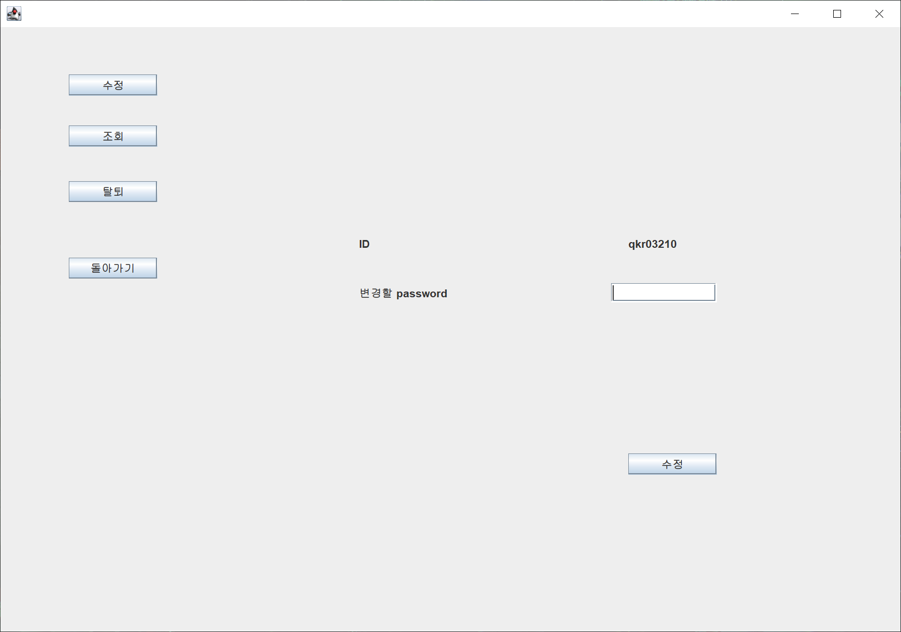|
|아이디찾기|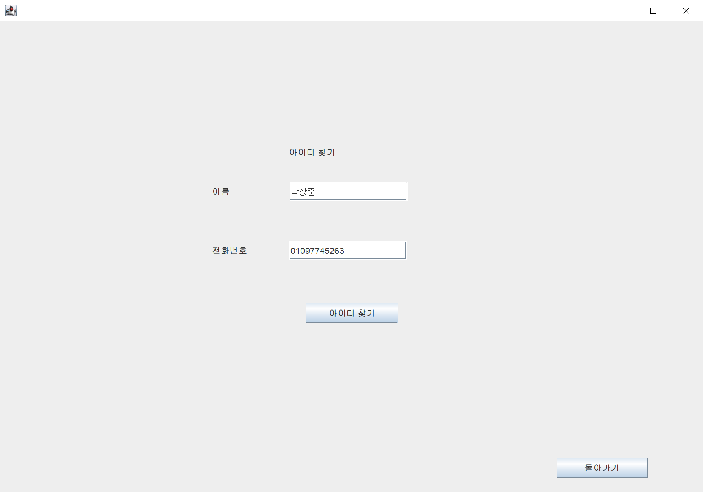|
|회원가입|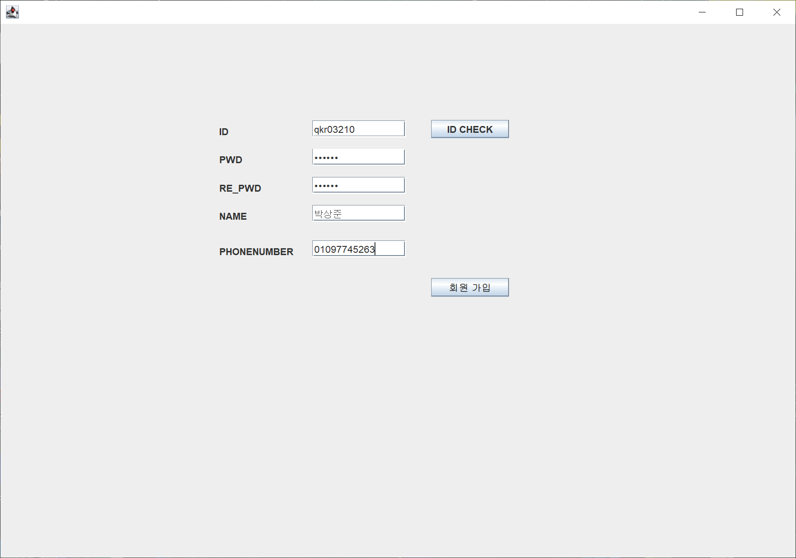|
|마이페이지<br>(탈퇴)|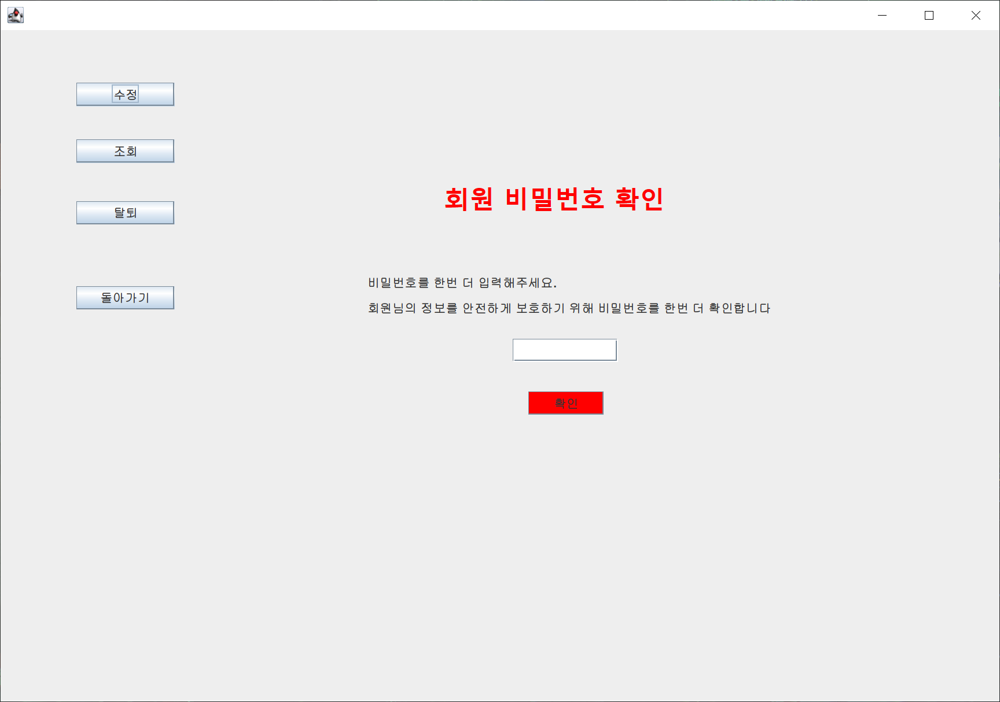|
|기타 알림창|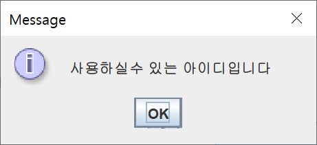<br>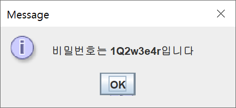<br>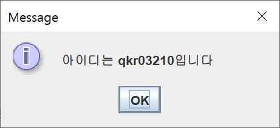<br>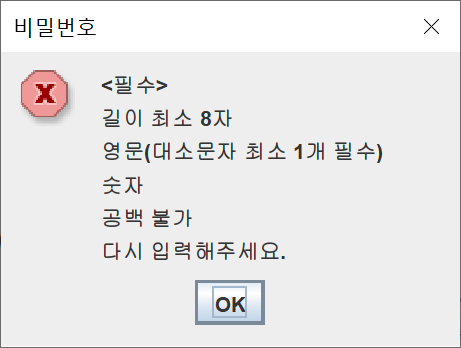|
    
</details>


## # 주요기능

* 메인화면
  <a href="MyProject\src\swing\MyProject.java">MyProject.java</a>
  - 프로그램은 회원만 접속 가능하며 로그인 화면을 먼저 접합니다.
  - 로그인 이후 도서검색이나 마이페이지로의 이동을 선택할 수 있습니다.

    ```
    //MyProject.java
    //패널 전환 부분 
    public static void switchTopPanel(JPanel pan) {
      ChangePanel.removeAll();
      ChangePanel.add(pan);
      ChangePanel.repaint();
      ChangePanel.revalidate();
    }
    ```
   
* 회원가입 및 로그인
  <a href="MyProject\src\swing\LoginPanel.java">LoginPanel.java</a>
  - 기본 로그인 회원가입 형식을 사용했습니다.
  - 아이디 및 비밀번호 찾기를 추가하였습니다.
    ```
    // DML.java
      /*
    * 로그인
    * 
    * @param id
    * @param pw
    * @return 0: 없는 사용자 | 1: 비밀번호 오류 | 2: 로그인 성공
    */
    public int login(String id, JPasswordField pw) {
      int idx = -1;
      try {
        if (tempConn == null)
          tempConn = DBConnManager.getConn("ai", "1234");
        /*
        * SELECT COUNT(*) FROM LIB_USERS WHERE LIB_UID = '유저아이디'
        */

        String query = "SELECT COUNT(*) FROM LIB_USERS WHERE LIB_UID='" + id + "'";

        pstmt = tempConn.prepareStatement(query);
        rs = pstmt.executeQuery();
        while (rs.next()) {
          idx = Integer.parseInt(rs.getString(1));
        }

        // 아이디 존재
        if (idx != 0) {
          if (checkPw(id, pw)) {
            JOptionPane.showMessageDialog(null, "로그인 성공");
            idx = 2;
          } else {
            JOptionPane.showMessageDialog(null, "비밀번호가 틀렸습니다");
            idx = 1;
          }
        }
        // 아이디 비존재
        else {
          JOptionPane.showMessageDialog(null, "없는 사용자입니다");
          idx = 0;
        }
      } catch (Exception e) {
        e.printStackTrace();
      } finally {
        try {
          if (rs != null)
            rs = null;
          if (cs != null)
            cs = null;
          if (stmt != null)
            stmt = null;
          if (pstmt != null)
            pstmt = null;
        } catch (Exception e) {
          e.printStackTrace();
        }
      }
      return idx;
    }
    ```
* 도서검색
  <a href="MyProject\src\swing\Book_MS_Panel.java">Book_MS_Panel.java</a>
  - 회원은 누구나 도서검색을 할 수 있으며 도서대여와 예약을 할 수 있습니다.
  - 모든 도서는 저자와 제목으로 검색이 가능합니다.
    ```
    btn_bookSearch.addActionListener(new ActionListener() {
			public void actionPerformed(ActionEvent arg0) {
				if (cmb_bookSearch.getSelectedItem().toString().equals("저자"))
					MyProject.dml.searchBook(table, (String) txt_bookSearch.getText(), "author");
				else
					MyProject.dml.searchBook(table, (String) txt_bookSearch.getText(), "title");
			}
		});
    ```
  - 도서 정보가 1만개씩 리스트로 사용자에게 보여집니다.
    ```
    private void makeTable() {
      int count = MyProject.dml.countAllBooks();
      pageLabel = makePage(count);
      for (JLabel lb : pageLabel)
        add(lb);

      for (int i = 0; i < selectedTable.length; i++) {
        selectedTable[i] = new JLabel("");
        selectedTable[i].setBounds(700, 60 + (60 * i), 200, 15);
        add(selectedTable[i]);
      }
    }
    
    private JLabel[] makePage(int cnt) {

      JLabel[] arr = new JLabel[cnt];
      for (int i = 0; i < cnt; i++) {
        JLabel mkLabel = new JLabel("" + (i + 1));

        mkLabel.addMouseListener(new MouseAdapter() {

          @Override
          public void mouseClicked(MouseEvent e) {
            btn_bookSearch.setEnabled(true);
            MyProject.dml.selectBooks(table, Integer.parseInt(mkLabel.getText(), 10) - 1);
          }

          @Override
          public void mouseEntered(MouseEvent e) {
            JLabel lb = (JLabel) e.getSource();
            lb.setForeground(Color.red);
          }

          @Override
          public void mouseExited(MouseEvent e) {
            JLabel lb = (JLabel) e.getSource();
            lb.setForeground(Color.black);
          }
        });

        mkLabel.setBounds(100 + (LB_WIDTH * i), 570, LB_WIDTH, LB_HEIGHT);
        arr[i] = mkLabel;
      }
      return arr;
    }
    ```
  - 리스트에서 도서를 클릭시 상세 정보가 사용자에게 보여집니다(대여가능,예약가능).
  - 선택한 도서가 대여(예약)가능일 경우 대여(예약)버튼을 눌러 대여(예약)할 수 있습니다.

    ```
    table.addMouseListener(new MouseAdapter() {
			@Override
			public void mouseClicked(MouseEvent arg0) {
				int row = table.getSelectedRow();
				int col = table.getSelectedColumn();
				for (int i = 0; i < table.getColumnCount(); i++) {
					selectedTable[i].setText((String) table.getModel().getValueAt(row, i));
				}
				String result = MyProject.dml.canRent(selectedTable[0].getText());
				lb_check_rental.setText(result);

				btn_bookSearch.setEnabled(true);
				//예약 중이면 둘다 없애고 예약 가능이면 예약 버튼 활성화 대여 가능이면 대여 버튼 활성화
				String temp = lb_check_rental.getText().trim();

				if (temp.equals("대여가능")) {
					btn_rental.setEnabled(true);
					btn_reserve.setEnabled(false);
				} else if (temp.equals("예약가능")) {
					btn_reserve.setEnabled(true);
					btn_rental.setEnabled(false);
				} else {
					btn_reserve.setEnabled(false);
					btn_rental.setEnabled(false);
				}

				repaint();
				revalidate();
			}
		});
    ```

  
  <!-- ```
  // models.py
  ``` -->

* 마이페이지
  <a href="MyProject\src\swing\MyPage.java">MyPage.java </a>
  <a href="MyProject\src\swing\MyInfo.java">MyInfo.java </a>
  - 개인적인 공간으로 회원 정보 조회, 회원 정보 수정, 회원 탈퇴 기능이 있습니다.
  - 회원 정보 조회는 현재 대여목록 조회, 모든 대여목록 조회, 예약목록 조회가 있습니다.
    ```
    //예약 목록 조회
    public void myReserv() {
      try {
        Class.forName("oracle.jdbc.driver.OracleDriver");

        conn = DriverManager.getConnection("jdbc:oracle:thin:@localhost:1521:xe", "AI", "1234");
        pstmt = conn.prepareStatement(
            "select r.ren_bid,bb.title,bb.author from lib_rental r, lib_books bb  where r.ren_bid=bb.bid and r.sun_id='"
                + MyProject.UserId + "'");
        rs = pstmt.executeQuery();

        String str[] = new String[5];
        DefaultTableModel model = (DefaultTableModel) table_reserve.getModel();
        model.setNumRows(0);
        while (rs.next()) {
          str[0] = rs.getString(1);
          str[1] = rs.getString(2);
          str[2] = rs.getString(3);

          model = (DefaultTableModel) table_reserve.getModel();
          model.addRow(str);
        }
      } catch (Exception e2) {
        e2.printStackTrace();
      } finally {
        try {
          if (rs != null)
            rs.close();
          if (pstmt != null)
            pstmt.close();
          if (conn != null)
            conn.close();
        } catch (Exception closee) {
        }
      }
    }
    ```

    ```
    //현재 대여내역 조회
    public void nowRental() {
      try {
        Class.forName("oracle.jdbc.driver.OracleDriver");
        conn = DriverManager.getConnection("jdbc:oracle:thin:@localhost:1521:xe", "AI", "1234");

        pstmt = conn.prepareStatement(
            "select r.ren_num,r.ren_date,r.rtn_date,r.pre_date, bb.title from lib_rental r, lib_books bb  where r.ren_bid=bb.bid and r.ren_user='"
                + MyProject.UserId + "'and r.rtn_date is null");
        rs = pstmt.executeQuery();

        String str[] = new String[5];
        DefaultTableModel model = (DefaultTableModel) table_rent.getModel();
        model.setNumRows(0);
        while (rs.next()) {
          str[0] = rs.getString(1);
          str[1] = rs.getString(2);
          str[2] = rs.getString(3);
          str[3] = rs.getString(4);
          str[4] = rs.getString(5);

          model = (DefaultTableModel) table_rent.getModel();
          model.addRow(str);
        }
      } catch (Exception e2) {
        e2.printStackTrace();
      } finally {
        try {
          if (rs != null)
            rs.close();
          if (pstmt != null)
            pstmt.close();
          if (conn != null)
            conn.close();
        } catch (Exception closee) {
        }
      }
    }
    ```

    ```
    //전체 대여내역 조회
    public void AllRental() {
      try {
        Class.forName("oracle.jdbc.driver.OracleDriver");

        conn = DriverManager.getConnection("jdbc:oracle:thin:@localhost:1521:xe", "AI", "1234");
        pstmt = conn.prepareStatement(
            "select r.ren_num,r.ren_date,r.rtn_date,r.pre_date, bb.title from lib_rental r, lib_books bb  where r.ren_bid=bb.bid and r.ren_user='"
                + MyProject.UserId + "'");
        rs = pstmt.executeQuery();

        String str[] = new String[5];
        DefaultTableModel model = (DefaultTableModel) table_rent.getModel();
        model.setNumRows(0);
        while (rs.next()) {
          str[0] = rs.getString(1);
          str[1] = rs.getString(2);
          str[2] = rs.getString(3);
          str[3] = rs.getString(4);
          str[4] = rs.getString(5);

          model = (DefaultTableModel) table_rent.getModel();
          model.addRow(str);
        }
      } catch (Exception e2) {
        e2.printStackTrace();
      } finally {
        try {
          if (rs != null)
            rs.close();
          if (pstmt != null)
            pstmt.close();
          if (conn != null)
            conn.close();
        } catch (Exception closee) {
        }
      }
    }
    ```
  - 선택한 대여 도서를 반납할수 있습니다.
    ```
    btn_return.addActionListener(new ActionListener() {
			public void actionPerformed(ActionEvent e) {
				try {
					String format_time1 = format1.format(System.currentTimeMillis());
					java.sql.Timestamp t = java.sql.Timestamp.valueOf(format_time1);

					Class.forName("oracle.jdbc.driver.OracleDriver");
					conn = DriverManager.getConnection("jdbc:oracle:thin:@localhost:1521:xe", "AI", "1234");

					// 반납 null 및 예약 테이블일때 반납 버튼 사라짐 (민성)
					if (t.equals("") || selectedRentNum.getText().equals("")) {
						JOptionPane.showMessageDialog(null, "책을 선택해 주십시오");
						return;
					}
					pstmt = conn.prepareStatement(
							"UPDATE lib_rental SET rtn_date='" + t + "' WHERE ren_num=" + selectedRentNum.getText());
					pstmt.executeQuery();
					repaint();
					revalidate();
				} catch (Exception e2) {
					e2.printStackTrace();
				} finally {
					try {
						if (rs != null)
							rs.close();
						if (pstmt != null)
							pstmt.close();
						if (conn != null)
							conn.close();
					} catch (Exception closee) {
					}
				}
				nowRental();
			}
		});
    ```
  - 회원 정보 수정은 재확인 과정을 통해 비밀번호를 수정할수 있습니다.
  - 회원 탈퇴는 재확인 과정을 통해 탈퇴를 진행할수있습니다.