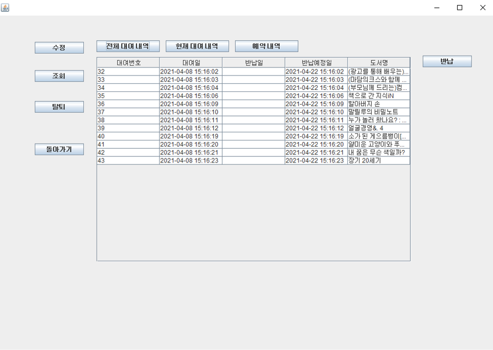

# # TeamProject
Jave와 OracleDB를 사용한 도서관리 프로그램입니다.
도서자료는 대구시립북부도서관의 csv 파일을 활용하였습니다.

## # 개요

  - Java Swing 프로젝트를 소개하는 역할을 합니다.

## # 순서도 및 화면 소개

|화면|사진|
|:--:|--|
|순서도||
|도서 검색 및 대여||
|마이페이지<br>(조회)||
<details>
    <summary>사진 더보기</summary>

|화면|사진|
|:--:|--|
|로그인||
|메인페이지||
|마이페이지<br>(개정정보수정)||
|아이디찾기||
|회원가입||
|마이페이지<br>(탈퇴)||
|기타 알림창|<br><br><br>|
    
</details>


## # 주요기능

* 메인화면
  - 프로그램은 회원만 접속 가능하며 로그인 화면을 먼저 접합니다.
  - 로그인 이후 도서검색이나 마이페이지로의 이동을 선택할 수 있습니다.
  
* 회원가입 및 로그인
  - 기본 로그인 회원가입 형식을 사용했습니다.
  - 아이디 및 비밀번호 찾기를 추가하였습니다.
  
* 도서검색
  - 회원은 누구나 도서검색을 할 수 있으며 도서대여와 예약을 할 수 있습니다.
  - 도서 정보가 1만개씩 리스트로 사용자에게 보여집니다.
  - 모든 도서는 저자와 제목으로 검색이 가능합니다.
  - 리스트에서 도서를 클릭시 상세 정보가 사용자에게 보여집니다(대여가능,예약가능).
  - 선택한 도서가 대여(예약)가능일 경우 대여(예약)버튼을 눌러 대여(예약)할 수 있습니다.
  
  <!-- ```
  // models.py
  ``` -->

* 마이페이지
  - 개인적인 공간으로 회원 정보 조회, 회원 정보 수정, 회원 탈퇴 기능이 있습니다.
  - 회원 정보 조회는 현재 대여목록 조회, 모든 대여목록 조회, 예약목록 조회가 있습니다.
  - 회원 정보 수정은 재확인 과정을 통해 비밀번호를 수정할수 있습니다.
  - 회원 탈퇴는 재확인 과정을 통해 탈퇴를 진행할수있습니다.